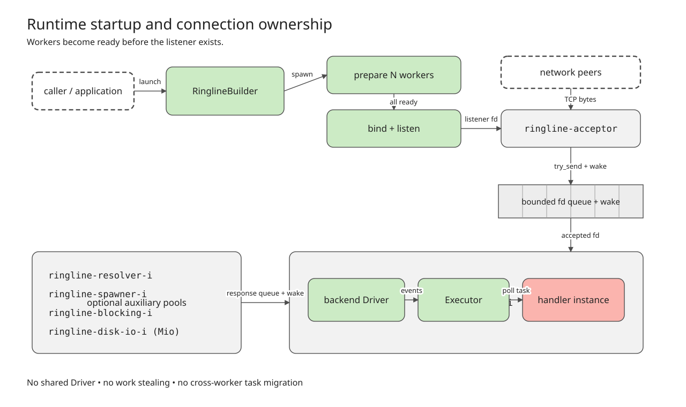
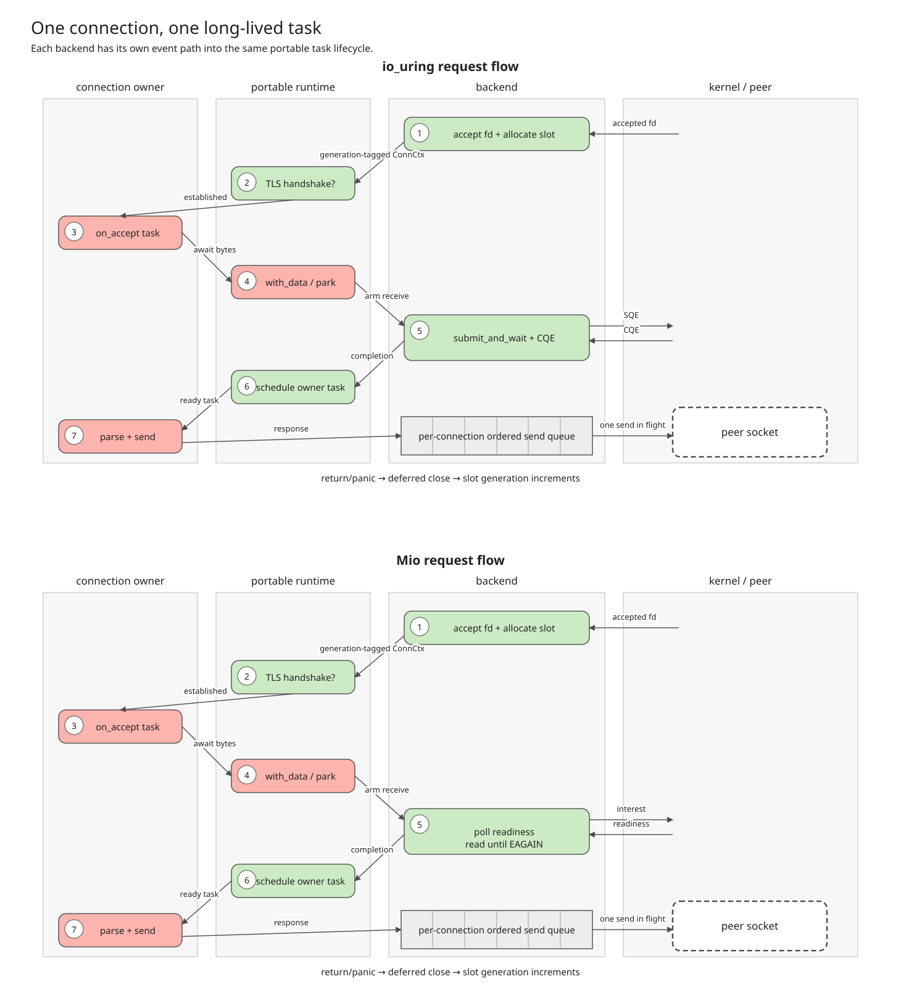

# Ringline architecture

Ringline is a thread-per-core asynchronous I/O runtime. Each worker owns its
I/O backend, executor, connection table, buffers, timers, and handler instance.
Tasks never migrate between workers, and there is no work-stealing scheduler.

This document describes the core `ringline` crate. Protocol crates build on its
`ConnCtx` API, but do not change the runtime topology.

## Library outline

The Cargo workspace contains the core runtime (`ringline`), protocol clients
(`ringline-redis`, `ringline-memcache`, `ringline-ping`, and `ringline-http`),
sans-I/O protocol/state-machine crates (`ringline-h2`, `ringline-h3`,
`ringline-grpc`, and `ringline-quic`), and benchmark tools (`ringline-bench` and
`ringline-benchmarks`). The fuzz harness is a separate, excluded workspace.

Within the core crate, the main boundaries are:

- Startup and process-level control: `worker.rs`, `acceptor.rs`, `config.rs`,
  `signal.rs`, `topology.rs`, and `wakeup.rs`.
- The portable executor and async API: `runtime/`, including `ConnCtx`, task
  slabs, timers, channels, futures, and wakers.
- Shared connection and buffer state: `connection.rs`, `accumulator.rs`,
  `recv/`, `handler.rs`, `buffer/`, and `tls.rs`.
- The io_uring backend: `backend/uring/`, with its ring wrapper, provided-buffer
  rings, driver, and completion-driven event loop.
- The Mio backend: `backend/mio/`, with its poll driver and readiness-driven
  event loop.
- Optional services: resolver, process spawner, blocking pool, filesystem,
  direct I/O, NVMe, and registered memory regions.

The principal public abstractions are `RinglineBuilder`, `ShutdownHandle`,
`AsyncEventHandler`, and `ConnCtx`. `AsyncEventHandler::create_for_worker`
constructs one handler instance per worker. Its `on_accept` method returns the
long-lived future for an accepted connection; `on_start` is the client-only
entry point; `on_tick` is a synchronous callback inside the worker loop.

## Startup and runtime topology

`RinglineBuilder::launch` delegates common setup to `launch_inner` in
`ringline/src/worker.rs`. Startup proceeds in this order:

1. Revalidate configuration, select the worker count, check `RLIMIT_NOFILE`,
   and initialize metrics metadata.
2. Create one bounded accepted-connection channel and one wake descriptor per
   worker. The channel carries `(RawFd, SocketAddr)`.
3. Start configured resolver, process-spawner, and blocking pools. Mio can also
   create per-worker disk-I/O pools.
4. Spawn `ringline-worker-{worker_id}` threads. Each optionally pins itself to a
   CPU, creates its handler, `Driver`, and `Executor`, calls `prepare_run`, and
   reports startup success or failure to the launching thread.
5. Wait for every worker to finish fallible preparation. Only then create the
   TCP or Unix listener and spawn the `ringline-acceptor` thread.

The auxiliary thread names are `ringline-resolver-{i}`,
`ringline-spawner-{i}`, `ringline-blocking-{i}`, and, on Mio,
`ringline-disk-io-{i}`.

The diagram above is generated from a checked-in, code-checked description; do
not edit the SVG by hand. In text: the caller starts N independent workers,
each containing one handler, executor, connection table, backend driver, and
backend poll object. When a stream listener is configured, one centralized
acceptor blocks in `accept4`/`accept`, sends each accepted descriptor through a
bounded per-worker channel, then writes that worker's eventfd or pipe. Optional
service pools return results through per-worker channels and use the same
cross-thread wake mechanism. A shared atomic shutdown flag and the per-worker
wake handles fan shutdown out to all workers. In client-only mode the listener
and acceptor are absent, and workers begin through `on_start`.

The acceptor assigns connections in configurable chunks. Its primary worker is
`(connection_count / conn_chunk_size) % worker_count`; if that worker's bounded
queue is full or disconnected, it tries adjacent workers. It never blocks on a
full channel. If every live worker is full, it closes the newly accepted
descriptor so accepted descriptors cannot accumulate without bound.

Worker-local raw task wakers are distinct from these cross-thread wake
descriptors. A task waker encodes a connection index, or a standalone task
index with `STANDALONE_BIT`, and pushes it into the thread-local `READY_QUEUE`.
`Executor::collect_wakeups` drains that queue through `wake_task`, transitions
parked tasks to ready, and appends them to the worker's `ready_queue`.
`CURRENT_DRIVER` and `CURRENT_TASK_ID` expose the current worker state only
while a future is being polled.

## Event loops and backend boundary

The backend is selected at compile time, not at runtime. For a Linux target
without `force-mio`, `ringline/build.rs` sets `has_io_uring` when the host
kernel is at least 6.0 or when the host kernel version is unavailable during
cross-compilation. `ringline/src/backend/mod.rs` then exports exactly one
`Driver` and one `AsyncEventLoop` implementation.

The io_uring loop in `backend/uring/event_loop.rs`:

1. Collects pending task wakes and replenishes returned receive buffers.
2. Submits pending SQEs and waits for a completion only if no task is already
   ready (`min_complete` is zero for runnable work and one otherwise).
3. Drains CQEs, decodes `UserData`/`OpTag`, and dispatches receive, send,
   connect, timer, wake, and subsystem completions.
4. Drains control and retry queues, checks TLS close deadlines, collects wakes,
   and polls ready futures.
5. Flushes SQEs produced while polling, immediately drains newly posted CQEs,
   and takes a fast-path poll pass for tasks they woke.
6. Calls the synchronous `on_tick` callback.

The Mio loop in `backend/mio/event_loop.rs` fires expired timers, computes a
poll timeout from the timer heap, calls `mio::Poll::poll`, handles readable and
writable sockets, drains cross-thread channels, polls ready tasks, flushes
dirty pending-send lists, records send completions, finishes deferred closes,
and calls `on_tick`. It drains channels even without a wake event to remain
correct under edge-triggered pipe behavior.

The executor, handler API, connection generations, waiters, accumulators, and
task-waker scheme are shared. The I/O mechanisms are not:

| Concern | io_uring | Mio |
| --- | --- | --- |
| Socket readiness/completion | CQEs identified by `UserData` and `OpTag` | `mio::Poll` readable/writable events |
| TCP receive | Multishot receive with provided buffers | Readiness read into owned memory |
| File descriptors | Fixed-file table for connections | Registered ordinary sockets |
| Sends | Copy pool plus guarded `SendMsgZc` scatter/gather | Owned/copy pending-send buffers |
| Send retry | CQE handling, retry lists, and POLLOUT operations | Writable readiness and dirty lists |
| Timers | Timeout SQEs and completion generations | Deadline min-heap |
| File/direct I/O | Submitted through the ring | Dedicated disk-I/O pool |
| NVMe and registered regions | Supported | Unsupported |

Mio therefore does not emulate CQEs, provided-buffer rings, fixed files, or
zero-copy sends. Conversely, the io_uring loop is completion-driven rather
than a readiness loop. Both backends preserve the same user-visible ordering
and lifetime rules.

Both backends use bounded, reusable application-managed buffers; pooling is
not unique to io_uring. The io_uring backend additionally registers/provides
selected pools to the kernel so a CQE can identify the buffer chosen for a
receive. Likewise, worker-local ownership is shared architecture; one ring per
worker is the io_uring-specific mapping of that architecture.

## Connection and request lifecycle

Each connection occupies a `ConnectionTable` slot. `ConnCtx` and `ConnToken`
carry both its index and generation. Every long-lived future and completion
path must reject a generation mismatch because a slot can be reused while old
work is still completing.

This diagram is also generated and checked against code-level architecture
constraints. It uses two vertically stacked panels rather than mixing backend
terms: the io_uring lifecycle is on top and the Mio lifecycle is below. Each
panel repeats the portable connection-task stages so its backend event path can
be read independently.

Their shared text equivalent is: an accepted descriptor enters a worker's
bounded channel; the worker allocates and initializes a generation-tagged slot,
arms receive, and either starts TLS or marks the plaintext connection
established. Once established, the worker places one `on_accept(ConnCtx)`
future in the connection task slab. That task parses buffered input immediately
or registers itself as the connection's receive waiter and parks. A backend
event makes bytes available and calls `Executor::wake_recv`; the executor wakes
the recorded owner task and polls the same future again. In the top panel, SQEs
produce CQEs. In the bottom panel, `mio::Poll` produces a readability event;
the event loop immediately drains `read` until it returns `WouldBlock`
(`EAGAIN`), then wakes the task that was waiting for receive data. In both
panels, the subsequent poll is a poll of the owner task's Rust future, not
another operating-system readiness poll. The handler parses a request and
submits a response through the per-connection send queue. A send completion
advances that queue and, for an awaited send, calls `wake_send`.
When the handler future returns or panics, the runtime closes that connection,
clears executor state, and eventually releases the slot with a new generation.

`ConnCtx::with_data` lends a byte slice; `ConnCtx::with_bytes` lends a
refcounted `Bytes` value whose slices can outlive the parse callback. Their
futures complete on `ParseResult::Consumed(n)`. `NeedMore` and `Consumed(0)`
register `owner_task` and `recv_waiters` and park without spinning;
`NeedAtLeast(n)` additionally reserves accumulator capacity. EOF resolves as
zero, and a stale generation behaves as EOF rather than exposing the new slot
occupant.

On the usual io_uring receive path, the kernel first writes into a provided
buffer. A parser can consume a pending buffer directly in the immediate fast
path; otherwise the runtime copies it into the per-connection accumulator and
returns its buffer ID to the ring. `with_bytes` provides zero-copy slicing after
that gather step, not a permanent reference to kernel-owned ring memory.

`send_nowait` eagerly submits an owned copy and returns without a future.
`send` also submits eagerly but returns `SendFuture`, which waits for the
logical send's completion. Neither form bypasses backend completion handling:
the completion is required to release pool or slab resources and advance the
queue. On io_uring, `send_parts` can retain guarded user memory for zero-copy
sends; on Mio guards are consumed by copying.

## TLS

TLS is implemented with rustls in the worker thread; it is not a separate
thread or executor. Inbound TLS connections create a `TlsConn` after slot
allocation but defer `on_accept` until `feed_tls_recv` reports
`HandshakeJustCompleted`. Outbound `connect_tls` similarly resolves only after
the TCP connection and TLS handshake complete. Handshake messages and alerts
use the normal per-connection send queue.

Receive ciphertext is fed to rustls, and decrypted plaintext is copied from
rustls into the accumulator or owned segmented chunks. Send plaintext is
encrypted into send-copy-pool storage. Guarded plaintext cannot remain
zero-copy through encryption. All TLS ciphertext chunks are serialized through
the same connection queue: independent io_uring SQEs are not wire-ordered, so
parallel TLS record submissions can interleave records.

On close, the runtime emits `close_notify`, drains its queued ciphertext, then
closes the socket. `close_notify_timeout_ms` bounds this graceful phase; an
expired deadline forces close. `ConnCtx::eof_truncated` distinguishes a TCP FIN
without peer `close_notify` from a clean TLS EOF.

## Backpressure, shutdown, and failures

Backpressure is bounded and explicit at each layer:

- Accepted descriptors use bounded per-worker channels. A full primary queue
  redirects to another worker; saturation of all workers drops the new
  connection.
- Receive accumulation is bounded by configuration. io_uring provided-buffer
  starvation (`ENOBUFS`) parks receive until returned buffers are replenished;
  it is not retried in a busy loop. Segmented receive has reserve and per-flow
  hold limits so one slow consumer cannot pin the whole shared ring.
- `ConnSendState` permits at most one in-flight send per connection and queues
  later sends in a `VecDeque`. This preserves stream and TLS order.
- Send-copy-pool, zero-copy slab, task-slab, and timer-slot exhaustion surface
  as errors. A caller using `send` can await completion; `send_nowait` reports
  immediate admission failures.
- Short sends retain their backing and resubmit the remainder. Socket `EAGAIN`
  retains the send and waits for POLLOUT/writable readiness. Transient ring
  submission pressure is handled by retry lists where the operation permits it.

An application's connection future returning is a close request, not permission
to discard queued bytes. The io_uring driver marks `close_pending`, drains
queued and in-flight sends in order, waits for any forwarded-buffer write,
cancels an armed multishot receive, and only then finalizes close. Stale CQEs
are normal during teardown and must release only their own backing without
touching a reused connection.

`ShutdownHandle::shutdown` sets a shared atomic flag, calls
`shutdown(SHUT_RD)` and `close` on the listener once, and wakes every worker.
The explicit socket shutdown is required to release a Linux acceptor blocked in
`accept4`; closing alone is insufficient. Dropping `ShutdownHandle` invokes the
same idempotent path. io_uring workers observe shutdown after draining a CQE
batch and run backend shutdown drainage; Mio workers finish the current
event/task/send/close cycle before returning.

Startup failures are returned from `launch`: workers acknowledge backend
preparation before the listener exists, and a failed worker, listener bind, or
acceptor spawn rolls back already-started workers. At runtime, a connection
handler panic closes that connection while preserving its worker; standalone
task and `on_tick` panics are also contained. Fatal accept errors stop the
acceptor, while `EINTR` and aborted connections retry and descriptor exhaustion
backs off briefly.

## Architectural invariants

Changes to the runtime and to the generated diagrams must preserve these
facts:

- There is one centralized stream acceptor and N independent workers; workers
  do not share a driver or executor.
- TCP accept does not use one `SO_REUSEPORT` listener per worker. Per-worker
  `SO_REUSEPORT` applies to UDP binds.
- Tasks stay on their owning worker. Kernel events wake a task through executor
  waiter/ready state; they do not normally call application code directly.
- A connection has one long-lived handler task, not one task per request.
- TLS handshake completion precedes `on_accept`.
- Connection identity is `(index, generation)` and stale completions are
  expected.
- Stream sends, partial-send retries, and TLS records are serialized per
  connection. `send_nowait` still requires completion cleanup.
- SQE-referenced memory lives until its CQE, and zero-copy guard memory lives
  until the notification CQE.
- Exactly one backend is compiled into a process. Mio must not be drawn with
  CQEs, provided buffers, fixed files, `SendMsgZc`, or NVMe.
